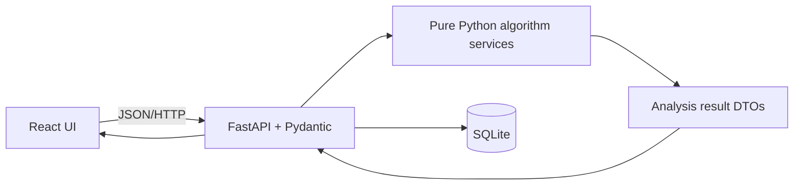

# PowerShare MM Project Plan

**Full title:** *PowerShare MM: A Game-Theoretic Decision Support and Simulation System for Shared Backup Electricity Scheduling and Cost Negotiation*

**Planning date:** Saturday, August 15, 2026

**Build window:** August 15–16, 2026

**Demonstration:** Monday, August 17, 2026

**Status:** Documentation and planning only; every implementation item is pending.

## Academic and delivery boundary

The mathematical decision engine is restricted to two-player concepts in Chapters 1–16 of Philip D. Straffin's *Game Theory and Strategy*, including Chapter 16, the Nash Arbitration Scheme and cooperative solutions. Roughly 70–80% of the mathematical/analytical core must be traceable to those chapters; the remaining 20–30% may be software engineering, storage, UI, visualization, animation, reporting, and usability. Chapter 17+ material—N-person games, strategic voting, Shapley Value, Shapley-Shubik Power Index, Banzhaf Index, nucleolus, and later coalition/stable-set algorithms—is explicitly excluded. External AI/ML cannot replace the game-theory engine; no paid or external AI API is required.

## 1. Project Summary

PowerShare MM is a two-business decision-support and educational simulation for sharing scarce backup electricity during Myanmar power outages. It turns energy capacity, demand, operating time, outage loss, cost contribution, urgency, and uncertainty into transparent two-player games. It then compares competitive and cooperative choices, explains stability and efficiency, and recommends energy, time-slot, and cost allocations.

It is more than a game: users enter a real scenario, receive auditable calculations and a practical recommendation, then use interactive simulations to understand how strategic behavior changes outcomes. It never controls electrical equipment. The prototype uses ordinary web forms, tables, charts, and lightweight 2D motion, so it runs on CPUs and integrated graphics without a dedicated GPU, local LLM, paid service, or heavy game engine.

## 2. Problem Statement

The frozen demonstration scenario should begin with:

| Item | Prototype value |
|---|---:|
| Player 1 | Mini Market |
| Player 2 | Phone/Computer Service Shop |
| Shared resource | Generator or battery |
| Available energy | 10 kWh |
| Player 1 demand | 6 kWh |
| Player 2 demand | 7 kWh |

Combined demand is 13 kWh, exceeding capacity by 3 kWh. Giving either business its full claim harms the other; simultaneous over-claiming can cause scheduling conflict, overload risk, or wasted negotiation time. Cooperation can instead prioritize essential loads, alternate time slots, and split operating cost. Unknown outage duration creates a decision under nature: a conservative schedule may protect essential service, while an optimistic schedule may produce greater benefit if power returns early. Negotiation must therefore identify an agreement that is feasible, individually better than disagreement, stable enough to accept, efficient, and reasonably fair.

## 3. Project Objectives

### Primary objective

Deliver an offline-capable Monday prototype that converts a two-business electricity-sharing scenario into explainable game-theoretic analysis and a feasible recommendation.

### Mathematical objectives

- [ ] Model strategies, outcomes, utilities, payoff matrices, uncertainty, repeated interaction, sequential moves, and arbitration using Chapters 1–16 only.
- [ ] Distinguish the main non-zero-sum sharing game from a deliberately defined zero-sum time-slot competition subproblem.
- [ ] Identify stable outcomes (best responses/Nash equilibria), efficient outcomes (Pareto frontier), and individually rational negotiated outcomes.
- [ ] Verify each major method against at least one manual calculation.

### Software objectives

- [ ] Build a React/Vite/TypeScript/Tailwind UI, FastAPI/Pydantic backend, isolated plain-Python algorithm layer, and minimal SQLite persistence.
- [ ] Provide validated JSON APIs, CPU-friendly charts/animation, tests, sample data, and offline startup instructions.

### Educational/demo objectives

- [ ] Explain why equilibrium may differ from cooperation or fairness.
- [ ] Show formulas, highlighted matrix cells, decision criteria, and concise English explanations with selective Myanmar-language help.
- [ ] Complete a reproducible 5–7 minute demonstration.

## 4. Scope

### In scope

- Exactly two players; scenario input; utility/payoff calculation; two-person payoff matrices.
- Dominance; a clearly scoped zero-sum subproblem; maximin/minimax, saddle points, and valid 2×2 mixed strategies.
- Games Against Nature; pure-strategy Nash equilibria; best responses; Pareto-optimal outcomes; Prisoner's Dilemma.
- Repeated play with Tit-for-Tat and a small comparison set (Always Cooperate, Always Claim More, and fixed-seed Random).
- Sequential negotiation/game trees; simulated commitments, credible promises, and credible threats.
- Nash arbitration and a fair recommendation for energy, time, and cost.
- A lightweight dashboard, accessible animations, and an English/Myanmar-ready string structure if time permits.

### Out of scope

- N-person models and all Chapter 17+ theories or applications.
- Shapley Value, Shapley-Shubik Power Index, Banzhaf Index, Nucleolus, and later coalition/stable-set algorithms.
- Real hardware control, IoT, payment processing, local AI models, complex prediction models, heavy 3D graphics, production authentication, and multi-tenant cloud deployment.

### Future scope (not part of Monday)

Hardware telemetry, richer localization, authentication, cloud deployment, exportable reports, more scenario templates, field calibration, and accessibility/user research may follow after academic review. Any future mathematical extension requires a separate scope decision and must not retroactively change this prototype's two-player Chapters 1–16 boundary.

## 5. Players, Strategies, Outcomes, and Assumptions

**Players.** Player 1 is the Mini Market; Player 2 is the Phone/Computer Service Shop. Each has demand, essential demand, desired time slots, estimated outage loss, stated cost contribution, urgency, and risk preference. The shared resource has energy capacity, available time slots, and operating cost.

**Basic behavioral strategies.** Each player chooses **Cooperate (C)**—honor an agreed cap/time/cost share—or **Claim More (M)**—seek additional scarce energy/time. Outcomes are `(C,C)`, `(C,M)`, `(M,C)`, and `(M,M)`. Additional named schedules may be evaluated in uncertainty or negotiation views, but never add players.

**Feasible allocation.** An outcome specifies nonnegative energy and time allocations within shared limits and cost shares totaling 100%. The disagreement/status-quo outcome represents no agreement: e.g., both lose service time while still incurring any unavoidable setup/conflict costs.

**Prototype assumptions (configurable and disclosed).** Inputs are estimates, electricity is divisible at prototype resolution, time slots are discrete, a kWh/time allocation has diminishing or capped benefit at demand, preferences remain fixed within one analysis, and players understand the displayed outcomes. Monetary values and service priorities may be normalized to `[0,100]` utility scores; normalized utility is not money. Initial weights are demonstration defaults, editable in advanced settings or frozen with written justification before implementation. Risk attitude affects decision-under-nature utility, not physical capacity. No result is an electrical safety instruction.

## 6. Mathematical Model

### Variable dictionary

| Symbol | Meaning | Unit/domain |
|---|---|---|
| `i ∈ {1,2}` | player | exactly two |
| `E` | available shared energy | kWh, `E ≥ 0` |
| `e_i`, `d_i`, `q_i` | allocated, requested, and essential energy | kWh |
| `T`, `t_i` | available and allocated operating slots | slot count or hours |
| `L_i` | estimated loss if fully unserved | MMK or normalized value |
| `c_i`, `C` | player's cost share and total resource cost | MMK |
| `s_i=c_i/C` | cost fraction | `[0,1]` |
| `r_i`, `u_i` | urgency and risk-preference inputs | normalized ranges |
| `v_i` | service value per useful kWh/time combination | value units |
| `B_i` | electricity/service benefit | value units |
| `A_i` | avoided outage loss | value units |
| `P_i^O`, `P_i^V` | overload/conflict and agreement-violation penalties | value units |
| `R_i` | raw payoff | value units |
| `U_i` | normalized utility/payoff | `[0,100]` |
| `d_i^0` | disagreement payoff | same scale as `U_i` |
| `p_k` | probability of nature state `k` | `[0,1]` |

### Transparent prototype formulation

Useful energy is `x_i = min(e_i, d_i)` and essential-service fraction is `f_i = min(x_i / max(q_i, ε), 1)`, where `ε` only prevents division by zero. A simple auditable service benefit is:

`B_i = v_i × x_i × min(t_i / max(T_i^desired, ε), 1)`.

Avoided outage loss is capped by service received:

`A_i = L_i × min(x_i / max(d_i, ε), 1) × min(t_i / max(T_i^desired, ε), 1)`.

Operating cost charged to player `i` is `c_i = s_i C`. Overload/conflict penalty `P_i^O` is zero for feasible outcomes and a declared scenario penalty for an attempted joint claim exceeding capacity or incompatible time slots. Agreement-violation penalty `P_i^V` is zero when the agreed cap and schedule are honored and a declared reputational/operational penalty otherwise.

Raw payoff is:

`R_i = w_B B_i + w_A A_i + w_E (100 f_i) + w_U (100 r_i f_i) - w_C c_i - P_i^O - P_i^V`.

The initial coefficients are **prototype assumptions**, not facts from the book. To avoid mixing units silently, monetary terms should first be converted to a common scenario value scale; alternatively all component scores should be min-max normalized before weighting. Nonnegative weights must sum to 1 within the normalized-score version. The UI must show weights and sensitivity warnings. For matrix comparison, normalize across the scenario's feasible outcomes:

`U_i(o) = 100 × (R_i(o) - R_i^min) / (R_i^max - R_i^min)`,

with all-equal raw payoffs mapped to 50 and explicitly flagged. The payoff at outcome `o` is `(U_1(o), U_2(o))`. The disagreement payoff `d_i^0 = U_i(o_disagreement)` must be calculated with the same scale. Nash arbitration considers only feasible `o` satisfying `U_i(o) ≥ d_i^0` for both players, and maximizes `(U_1-d_1^0)(U_2-d_2^0)`.

### Validation constraints

- `e_1 + e_2 ≤ E`; all allocations, demands, costs, losses, and times are nonnegative.
- Allocated simultaneous time/slots cannot exceed availability; mutually exclusive slot assignments cannot overlap.
- `s_1 + s_2 = 1` within numeric tolerance; each share is in `[0,1]`.
- `Σp_k = 1` within tolerance and every `p_k ≥ 0`.
- Essential demand cannot exceed stated demand without an explicit warning/correction.
- Mixed-strategy probabilities must lie in `[0,1]` and total 1 per player.
- Arbitration requires a nonempty feasible, individually rational set relative to the disagreement point; otherwise report “no qualifying agreement,” not a fabricated answer.

## 7. Book-Based Algorithm Plan

The chapter labels below are concept-level traceability to Straffin Chapters 1–16; page numbers/edition-specific chapter titles must be checked against the team's physical edition during Saturday's model freeze.

### Book Traceability Matrix and algorithm contracts

| # | Method and book trace | Purpose / input | Expected output and PowerShare use | Planned module/function | Validation |
|---:|---|---|---|---|---|
| 1 | Strategies, outcomes, payoff matrices (Chs. 1–2 foundations) | Encode finite choices and paired utilities | Labeled bimatrix for Cooperate/Claim More | `algorithms/payoffs.py::build_bimatrix` | hand-derived 2×2 scenario |
| 2 | Dominance Principle (early two-person games) | Compare each strategy's payoffs across opponent choices | strictly/weakly dominated rows or columns, with distinction | `matrix.py::find_dominance` | dominated and nondominated fixtures |
| 3 | Maximin/minimax (two-person zero-sum) | Security levels from one payoff matrix | row maximin, column minimax | `zero_sum.py::maximin_minimax` | manual row-min/column-max |
| 4 | Saddle point (zero-sum) | Test equality of security levels | saddle cells and game value | `zero_sum.py::find_saddles` | games with/without saddle |
| 5 | Zero-sum game value | Quantify competitive equilibrium | value to row player and negative value to column player | `zero_sum.py::solve_pure` | constant-sum/sign checks |
| 6 | 2×2 mixed strategies (two-person zero-sum) | Make opponent indifferent when no saddle and denominator is valid | probabilities and game value | `zero_sum.py::solve_mixed_2x2` | totals 1; equal expected payoffs; degeneracy rejected |
| 7 | Game trees, backward reasoning/pruning (sequential games) | Analyze ordered offers/responses | recommended path, terminal payoffs, pruned branches | `game_tree.py::backward_induction` | small hand-solved tree |
| 8 | Utility Theory (decision preferences) | Convert ranked/valued consequences consistently | disclosed utilities and sensitivity data | `utility.py::score_outcome` | boundaries, monotonicity, manual score |
| 9 | Games Against Nature (decision under uncertainty) | Compare schedule payoff table across outage states | criterion score and chosen schedule | `nature.py::*` | manual fixture per criterion |
| 9a | Expected Value | payoff table + probabilities | probability-weighted choice | `expected_value` | probabilities and dot product |
| 9b | Wald/Maximin | payoff table | best worst-case choice | `wald` | row minima |
| 9c | Maximax | payoff table | best best-case choice | `maximax` | row maxima |
| 9d | Laplace | equiprobable states | best mean payoff | `laplace` | arithmetic mean |
| 9e | Minimax Regret | payoff table | regret matrix and least maximum regret | `minimax_regret` | column best minus payoff |
| 9f | Hurwicz | payoff table + optimism `α∈[0,1]` | `α max +(1-α) min` choice | `hurwicz` | α=0/1 endpoint checks |
| 10 | Pure-strategy Nash equilibrium (non-zero-sum games) | paired payoff matrix | mutual best-response cells | `bimatrix.py::pure_nash` | one, multiple, and none |
| 11 | Best responses | paired payoff matrix | row/column best-response sets | `bimatrix.py::best_responses` | ties retained |
| 12 | Pareto optimality | feasible paired outcomes | nondominated frontier | `efficiency.py::pareto_front` | dominance pairwise/manual |
| 13 | Prisoner's Dilemma | ordered 2×2 C/M payoffs | detection plus failed-condition explanation | `bimatrix.py::detect_prisoners_dilemma` | canonical PD and near miss |
| 14 | Repeated play | stage game, strategies, rounds, seed | history, totals, cooperation rate | `repeated.py::simulate` | deterministic fixed seed |
| 15 | Tit-for-Tat/comparisons | prior opponent move/history | next action and comparison metrics | `strategies.py::*` | first cooperate, then mirror |
| 16 | Strategic moves: commitment, credible promise/threat | baseline and modified sequential payoffs | credibility test and changed path | `strategic_moves.py::evaluate_move` | actor must prefer carrying out move at reached node |
| 17 | Nash Arbitration Scheme/cooperative solutions (Ch. 16) | feasible utility pairs + disagreement point | individually rational point maximizing Nash product, ties disclosed | `arbitration.py::nash_arbitration` | manual products, invalid disagreement, tie |

The main sharing game is non-zero-sum: both businesses can gain from avoiding outage loss, so its paired payoffs are analyzed with best responses, Nash equilibrium, Pareto efficiency, and arbitration. Maximin/minimax, saddle points, and zero-sum mixed strategies apply only to an explicitly labeled competitive time-slot subproblem where one player's gain is defined as the other's loss (for example, priority over a single indivisible peak slot). The UI must never present that subproblem as the complete sharing model.

Strategic commitment is simulated as an observable, hard-to-reverse restriction of future choice. A promise is credible only if honoring it is optimal when its decision node is reached; a threat is credible only if carrying it out is then rational. The system reports credibility rather than treating every statement as binding. Evolutionarily Stable Strategy is excluded from the MVP because no natural, defensible need exists.

**Myanmar aid:** Nash equilibrium means neither shop benefits by changing alone—“တစ်ဖက်တည်း မဟာဗျူဟာပြောင်းလဲလျှင် အကျိုးမတိုးသော ရလဒ်.” Pareto optimal means one shop cannot improve without worsening the other. Nash arbitration selects an agreement above the disagreement point that maximizes the product of both gains; it is not simply a 50/50 split.

### Non-book technical contributions

React screens, API validation, SQLite records, chart rendering, accessible animation, localization scaffolding, test automation, seeded randomness, setup scripts, reporting, and presentation assets are engineering contributions, not book-derived mathematical methods.

## 8. Core System Modules

| Module | Input → processing → output | Related theory | MVP priority |
|---|---|---|---|
| Scenario Builder | resource/player/nature fields → validate → scenario JSON | strategies/outcomes, utility inputs | P0 |
| Utility and Payoff Generator | scenario + candidate outcomes → formulas/normalization → paired payoffs | Utility Theory/payoff matrices | P0 |
| Matrix Analyzer | bimatrix or scoped zero-sum matrix → dominance, responses, Nash, Pareto, zero-sum checks → annotated cells | matrix games, equilibrium | P0 |
| Uncertainty Analyzer | schedules × outage states + probabilities/α → six criteria → ranked comparison | Games Against Nature | P0 (four methods minimum; six target) |
| Negotiation/Game-Tree Simulator | offers, responses, terminal payoffs → backward reasoning/credibility → path | sequential/strategic moves | P1 |
| Nash Arbitration/Fair Allocation Engine | feasible energy/time/cost candidates + disagreement → filter/product → recommendation | Ch. 16 arbitration | P0 |
| Repeated-Game Simulator | stage matrix, strategies, rounds, seed → iterative play → history/score | repeated play, Tit-for-Tat | P0 |
| Results Dashboard | all analysis DTOs → explanations/charts → final summary | explanatory synthesis | P0 |
| Theory Guide | curated concept text/formulas → contextual help → reference cards | Chs. 1–16 | P1 |
| Scenario Persistence | validated scenario/result → SQLite CRUD → reloadable demo | non-book engineering | P1; in-memory/file fallback |

## 9. User Flow

1. Open the provided demo scenario or create one.
2. Enter shared-resource capacity, slots, and cost.
3. Enter Player 1 demand, essential demand, loss, urgency, contribution, and preference.
4. Enter the same fields for Player 2.
5. Validate capacity, time, contribution, and nature-state probabilities.
6. Generate candidate outcomes, utilities, and the paired payoff matrix.
7. Identify dominated strategies, with strict/weak labels.
8. Highlight best responses, pure Nash equilibria, and Pareto outcomes.
9. Compare outage-duration choices using Games Against Nature.
10. Run the negotiation tree and show credible strategic moves.
11. Calculate the individually rational Nash arbitration recommendation.
12. Optionally run repeated play with Tit-for-Tat/comparison strategies.
13. Display recommended energy, time slots, and cost shares.
14. Explain feasibility, stability, efficiency, uncertainty criterion, and fairness rationale.

## 10. Pages and Interface

| Screen | Essential components | Responsive approach |
|---|---|---|
| Landing/Demo Selection | title, limitation notice, load demo/create actions | single-column cards on mobile |
| Scenario Builder | stepped resource/player/nature form, units, validation summary | one field column mobile; grouped panels desktop |
| Payoff Matrix Analysis | 2×2 matrix, overlays for dominance/best response/Nash/Pareto, explanation | horizontally scrollable matrix, tap legend |
| Uncertainty Analyzer | payoff table, criterion selector, probability/α controls, comparison chart | stacked controls; compact table |
| Negotiation Room | offer cards, small game tree, credibility explanation | vertical tree/list fallback |
| Fair Allocation Result | energy/time/cost cards, disagreement comparison, Nash product | stacked shop cards mobile |
| Repeated-Game Simulation | strategy selectors, rounds, run/reset, score/cooperation chart | reduced chart points/labels |
| Final Dashboard | scenario summary, key findings, warnings, print/demo mode | single-column narrative mobile |
| Theory Guide | glossary, formulas, chapter trace, Myanmar help snippets | searchable accordion |

For Monday, these may be one route with tabs: **Scenario**, **Analysis**, **Negotiation**, **Simulation**, **Result/Theory**. Separate routes are optional polish.

## 11. Visual Design and Lightweight Animations

Use two shop cards, a generator/battery capacity indicator, simple energy-flow lines, on/off shop-light states, progress bars, numeric counters, payoff-cell highlighting, short game-tree node transitions, blue/green cooperation and amber/red conflict states, and a restrained success pulse. Prefer CSS transforms/opacity and small Framer Motion transitions; use Recharts only for compact 2D charts. No high-resolution 3D assets or particles. Animation must be optional/reducible, respect `prefers-reduced-motion`, avoid conveying meaning by motion/color alone, and remain usable with animation disabled.

## 12. Architecture

The proposed compatible stack is React + Vite + TypeScript + Tailwind CSS, optional Framer Motion, Recharts, FastAPI + Pydantic, plain Python (NumPy only if it materially simplifies numeric work), SQLite, Pytest, Vitest, and optional Playwright. No pre-existing scaffold was found, so there is no existing stack to replace.



Algorithm functions accept typed domain values and return deterministic results without importing FastAPI, SQLite, or UI code. This separation enables direct unit tests and manual-fixture comparison.

## 13. Proposed Repository Structure

```text
PowerShareMM/
├── frontend/
│   ├── src/{components,pages,features,api,types,i18n}/
│   └── tests/
├── backend/
│   ├── app/{api,models,schemas,services}/
│   ├── app/algorithms/{utility,payoffs,matrix,zero_sum,nature,game_tree,strategic_moves,efficiency,arbitration,repeated}.py
│   └── tests/{unit,api}/
├── data/sample_scenarios/
├── docs/{MATHEMATICAL_MODEL.md,BOOK_TRACEABILITY.md,DEMO_SCRIPT.md,TEST_REPORT.md}/
├── presentation/{slides,screenshots}/
├── report/
├── PROJECT_PLAN.md
└── README.md
```

The traceability may remain in this plan for MVP and later be copied to `docs/BOOK_TRACEABILITY.md` without changing its content.

## 14. Data Model

| Entity | Essential fields only |
|---|---|
| Scenario | `id`, `name`, `resource`, exactly two `players`, `nature_states`, `created_at` |
| Player | `id` (`P1/P2`), `name`, `demand_kwh`, `essential_kwh`, `desired_slots`, `outage_loss`, `cost_contribution`, `urgency`, `risk_preference` |
| SharedResource | `type`, `capacity_kwh`, `available_slots`, `operating_cost` |
| NatureState | `id`, `label`, `outage_duration`, `probability` |
| Strategy | `id`, `player_id`, `name`, `action`/schedule parameters |
| Outcome | `strategy_pair`, energy/time allocations, cost shares, penalties, paired utilities, `feasible` |
| AnalysisResult | `id`, `scenario_id`, algorithm name/version, inputs hash, result JSON, explanation, warnings |
| Simulation | `id`, `scenario_id`, strategy pair, rounds, seed, totals |
| SimulationRound | `simulation_id`, round, actions, payoffs, cumulative payoffs |
| ArbitrationResult | disagreement pair, qualifying candidates, selected allocation, gains, Nash product, ties/warnings |

For the prototype, store scenario and result JSON where relational decomposition adds no demo value. Enforce exactly two players in validation. Do not add user/account/tenant tables.

## 15. API Plan

| Method/path | Purpose |
|---|---|
| `GET /api/health` | readiness/version |
| `POST /api/scenarios` | validate and save scenario |
| `GET /api/scenarios/{id}` | retrieve scenario |
| `POST /api/analysis/payoffs` | generate outcomes/bimatrix |
| `POST /api/analysis/matrix` | dominance, best responses, Nash, Pareto; optional scoped zero-sum result |
| `POST /api/analysis/uncertainty` | decision-under-nature comparison |
| `POST /api/analysis/arbitration` | filter and maximize Nash product |
| `POST /api/simulations/repeated` | run seeded repeated game |
| `GET /api/results/{id}` | retrieve stored result |

Example arbitration request:

```json
{"disagreement":[20,15],"candidates":[{"id":"A","utilities":[70,60],"energy_kwh":[5,5],"cost_shares":[0.5,0.5]}]}
```

Example response:

```json
{"selected":"A","utilities":[70,60],"gains":[50,45],"nash_product":2250,"individually_rational":true,"ties":[]}
```

All error responses should identify the field, constraint, and correction. Generated results should include method name, explanation, and warnings, not only numbers.

## 16. Two-Day Execution Plan

All work below is **pending**. Times use Asia/Rangoon. Essential work ends Sunday; Monday contains demonstration only.

### Saturday, August 15 — foundation and vertical slice

| Time | Work | Dependency/type | Checkpoint |
|---|---|---|---|
| 08:00–09:00 | repository/documentation preflight; ownership and branches | blocking | plan and file ownership agreed |
| 09:00–10:30 | freeze formulas, normalization, disagreement, candidate generation, tolerances | blocking | manual calculation signed off |
| 10:30–11:00 | freeze 10 kWh sample and expected answers | blocking | canonical fixture committed |
| 11:00–12:30 | scaffold frontend/backend/tests; contracts/types | blocking then parallel | both apps start locally |
| 13:30–16:00 | implement core algorithms and unit tests; parallel basic API/form | parallel | payoffs, Nash, Pareto, nature tests pass |
| 16:00–17:00 | integrate scenario → payoff API → basic result table | integration checkpoint | first vertical slice |
| 17:00–18:30 | arbitration, zero-sum subproblem, validation tests | parallel | manual fixtures match |
| 18:30–19:30 | API contract tests and defect fix | test checkpoint | P0 backend green |
| 19:30–20:00 | review scope/status; lock Sunday blockers | integration checkpoint | no unresolved formula ambiguity |

### Sunday, August 16 — integration, verification, freeze

| Time | Work | Dependency/type | Checkpoint |
|---|---|---|---|
| 08:00–09:30 | frontend/backend integration and error states | blocking | canonical scenario completes |
| 09:30–11:00 | arbitration and Games Against Nature comparison UI | parallel after contracts | values match manual sheets |
| 11:00–12:00 | repeated game/Tit-for-Tat and game-tree minimum | parallel | fixed-seed test passes |
| 13:00–14:30 | dashboard, charts, reduced-motion 2D polish | nonblocking polish | usable animation-off mode |
| 14:30–15:30 | API/UI errors, responsive pass, offline check | integration | clean reload and invalid-input flow |
| 15:30–16:30 | full unit/API/Vitest tests; optional one Playwright flow | test checkpoint | release candidate test report |
| 16:30–17:30 | end-to-end demo rehearsal and timed script | blocking | 5–7 minute run succeeds twice |
| 17:30–18:15 | README/docs, screenshots, presentation | parallel documentation | setup verified on clean shell |
| 18:15–19:00 | final regression and fallback sample verification | test checkpoint | offline fallback demonstrated |
| **19:00** | **demo freeze** | no new features | release candidate tagged/copied by owner |
| 19:00–20:00 | backup dependencies/instructions, slides, final test report | release only | two recoverable demo copies |

Monday has no implementation allocation. Optional items are cut at the first missed P0 checkpoint.

## 17. Team Allocation

### Recommended four-person team

| Role / file ownership | Exact deliverables | Interfaces | Deadline |
|---|---|---|---|
| 1. Mathematical/Algorithm Lead (`backend/app/algorithms`, unit fixtures, math doc) | formulas, algorithms, canonical expected values, unit tests, traceability review | publishes typed function contracts to Role 2 and explanation metadata to Role 3 | model freeze Sat 10:30; P0 engine Sat 18:30 |
| 2. Backend/API & Database Lead (`backend/app/api,models,schemas,services`) | FastAPI, validation, SQLite/fallback repository, API tests | consumes Role 1 functions; freezes DTOs with Role 3 | API Sat 17:00; integrated Sun 09:30 |
| 3. Frontend/UI & Animation Lead (`frontend`) | scenario form, analysis/results UI, charts, reduced motion | consumes DTO examples from Role 2; never duplicates math | basic table Sat 17:00; UI Sun 14:30 |
| 4. Integration, Testing, Docs & Presentation Lead (`README`, `docs`, `presentation`, integration tests) | integration branch ownership, acceptance suite, demo script, screenshots, backups, test report | coordinates all roles; sole release integrator | rehearsal Sun 17:30; freeze Sun 19:00 |

### Fallback three-person team

1. Math + backend algorithm lead owns pure functions/tests; P0 engine Saturday.
2. API + integration lead owns schemas, API, SQLite, contracts, release merge; vertical slice Saturday.
3. Frontend + QA/docs lead owns UI, Vitest, manual demo, slides; UI integration Sunday. Cut persistence UI and elaborate game tree before combining blocking ownership.

### Fallback two-person team

1. Engine/backend/integration owner: formulas, algorithms, API, fixtures, Pytest, single release branch integration.
2. Frontend/demo owner: form/dashboard, client contracts, Vitest, docs, presentation, rehearsal.

For two people, use the preconfigured sample, combine screens into tabs, make SQLite and game-tree visuals optional, and freeze API examples before parallel work. Each blocking file has one owner; changes from others arrive through review/cherry-pick/PR rather than simultaneous editing.

## 18. Git Collaboration Workflow

- Initialize/use `main` as the stable integration baseline; avoid direct feature work on it and designate one integration owner.
- Use small branches such as `docs/project-plan`, `feat/math-engine`, `feat/backend-api`, `feat/frontend-dashboard`, `feat/simulation`, and `test/integration`.
- Pull and rebase a private feature branch before integration when safe; never force-push a shared branch.
- Commit small verified changes with messages such as `feat(math): add pure Nash analysis` or `test(api): reject invalid probabilities`.
- Open focused pull requests when hosting supports them; require formula-owner review for math and contract-owner review for DTO changes.
- Announce shared schema changes and integrate at scheduled checkpoints. Avoid assigning the same blocking file to multiple people.
- Never commit `.env`, credentials, virtual environments, `node_modules`, private-data databases, build output, generated caches, or test artifacts. Commit only sanitized sample data.

## 19. Testing and Mathematical Verification

- [ ] Unit-test every formula, boundary, normalization path, tolerance, and penalty.
- [ ] Verify known zero-sum matrices with a saddle point and without one; verify game value and sign convention.
- [ ] Test strictly/weakly dominated and nondominated strategies.
- [ ] Test one, multiple, and no pure Nash equilibria; retain tied best responses.
- [ ] Verify Pareto-front detection with dominated, equal, and incomparable utility pairs.
- [ ] Check valid 2×2 mixed-strategy probabilities total 1, reproduce indifference, and reject zero-denominator/degenerate or out-of-range results.
- [ ] Manually verify Expected Value, regret matrix, Wald, Maximax, Laplace, Minimax Regret, and Hurwicz (including `α=0,1`).
- [ ] Verify Nash products, individual rationality, ties, infeasible allocations, empty qualifying sets, and invalid disagreement points.
- [ ] Verify repeated-game determinism with a fixed seed and Tit-for-Tat's initial/mirroring behavior.
- [ ] Validate negative values, excess allocation, overlapping slots, essential>demand, cost shares, probabilities, exactly-two-player rule, and malformed API data.
- [ ] Add API contract tests and one end-to-end canonical demo flow (Playwright optional; documented manual flow required).
- [ ] For each major algorithm family—matrix/zero-sum, bimatrix equilibrium/Pareto, nature, utility, arbitration, repeated/sequential play—write at least one manual calculation and compare exact/tolerance results with program output.

Numerical tests must use declared tolerances; tests should compare sets where ties/order are mathematically irrelevant. A failed manual comparison blocks the demo freeze.

## 20. Monday Demo Script Outline

Target: **5–7 minutes**.

1. **0:00–0:45:** Introduce Myanmar's shared-backup problem and clarify decision support, not hardware control.
2. **0:45–1:20:** Load the two shops, 10 kWh capacity, and 13 kWh combined demand.
3. **1:20–2:10:** Generate the payoff matrix and point out strategies/payoffs.
4. **2:10–3:00:** Contrast pure Nash equilibrium with a Pareto-superior cooperative outcome.
5. **3:00–3:50:** Compare uncertain outage schedules using nature criteria.
6. **3:50–4:50:** Show disagreement, individual rationality, Nash products, and energy/time/cost recommendation.
7. **4:50–5:40:** Run a short Tit-for-Tat repeated simulation and show cooperation history.
8. **5:40–6:30:** Show the final dashboard, limitations, book boundary, and conclusion; keep 30 seconds buffer.

## 21. MVP Acceptance Criteria

Sunday-night pass requires all of the following:

- [ ] Project starts locally with documented commands and installed dependencies; canonical demo loads.
- [ ] Validation enforces exactly two players and feasible capacity/time/cost/probability inputs.
- [ ] Utility and paired payoff matrix are generated with visible assumptions.
- [ ] Pure Nash equilibria, best responses, and Pareto outcomes match verified fixtures.
- [ ] At least four nature methods work (target all six listed methods).
- [ ] Nash arbitration returns a feasible, individually rational allocation or an honest no-solution result.
- [ ] Repeated simulation runs deterministically with a seed; Tit-for-Tat is available.
- [ ] Final energy, time, cost, rationale, method, and warnings are visible.
- [ ] Algorithm tests pass; canonical API/manual end-to-end flow passes.
- [ ] No dedicated GPU, paid API, external AI, or internet connection is required after dependencies are installed.

## 22. Risk Register and Fallback Plan

| Risk | Mitigation | Fallback |
|---|---|---|
| Two-day limit | P0 gates, fixed contracts, Sunday 19:00 freeze | cut persistence, routes, tree animation, optional methods before core |
| Formula error | manual fixtures, math-owner review, tolerances | use frozen canonical tables with clearly documented calculations while fixing; never invent output |
| Arbitrary utility assumptions | expose weights/units, sensitivity note, academic review | use a fixed disclosed rubric and state limitation |
| Frontend/backend delay | mock JSON contract and early vertical slice | frontend loads precomputed local sample JSON |
| Animation performance | transforms/opacity, reduced motion, profile integrated laptop | disable all animation without losing information |
| Merge conflicts | file ownership, small branches, one integrator | stop feature merges; integrate only P0 commits |
| Internet unavailable | install/cache dependencies early, offline instructions | serve built frontend and local backend; retain screenshots |
| Laptop performance | small datasets, bounded rounds/candidates, no GPU/ML | reduce chart points/rounds; use static tables |
| SQLite failure | repository abstraction and sanitized seed | in-memory/local JSON demo scenario/results |
| Optional feature incomplete | label P1/P2 and review at checkpoints | hide incomplete controls; never demo broken UI |

The mandatory fallback is a preconfigured local sample scenario that runs without persistence, animation, or advanced navigation. It must show the validated input, precomputed-or-live verified matrix analysis, nature comparison, arbitration result, repeated-game table, and explanations offline. Screenshots and a short recording/slides are secondary backup, not substitutes for checking calculations.

## 23. Deliverables Checklist

- [ ] Source code (pending)
- [x] `PROJECT_PLAN.md` planning document
- [ ] Mathematical model documentation and manual calculations
- [x] Book traceability section (standalone document optional after MVP)
- [ ] Sanitized sample scenarios
- [ ] Unit, API/integration, and frontend tests
- [ ] README setup/offline/demo instructions
- [ ] Screenshots
- [ ] Presentation
- [ ] Short 5–7 minute demo script
- [ ] Recoverable backup copy
- [ ] Final test report with environment, commands, results, and known limitations

## 24. Definition of Done

### Required MVP—ready for Monday

Every Section 21 acceptance criterion passes by Sunday night; manual calculations agree with program output; the sample completes the 5–7 minute offline script twice; setup, limitations, book traceability, and fallback steps are documented; source, presentation, test report, and backup are available. There are no known P0 mathematical or startup defects.

### Optional polish

Separate routes, Myanmar translations beyond key help text, richer game-tree interaction, SQLite browsing UI, all six nature methods if only four are stable, extra comparison strategies, Playwright automation, exports, and refined animation are included only after the required MVP is frozen.

### Postponed work

Future-scope items from Section 4, production security/deployment, real-world calibration studies, hardware/IoT integration, complex prediction, and any academic method outside the stated Chapters 1–16 two-player boundary are not Monday deliverables.

---

## Planning assumptions and change control

This plan assumes an empty repository, an unknown team size, a local offline demonstration, and permission to adopt the recommended stack because no compatible scaffold currently exists. The team must verify Straffin chapter labels against its edition, agree on monetary-to-utility scaling, freeze candidate allocations/time slots, and record canonical hand calculations before coding. Any mathematical rule, default weight, API contract, or P0 scope change after Saturday's freeze requires approval from the mathematical lead and integration owner and an update to traceability/tests. No feature in this document is claimed as implemented.
